## Create a python virtual environment
```
python -m venv venv
```

## Activate the virtual environment
```
For windows: venv\Scripts\activate

For Linux: source venv/bin/activate
```

## Install the required packages
```
pip install -r requirements.txt
```


Note: All the image are expected to be present in the RGB_samples folder.


## Run the following command to rename the images in the RGB_samples folder
```
python3 image_renamer.py
```

## Run the following command to crop and augment the images to create the rgb_cropped_images folder
```
python3 image_cropper.py
```

## Following are some of the sample images from the rgb_cropped_images folder
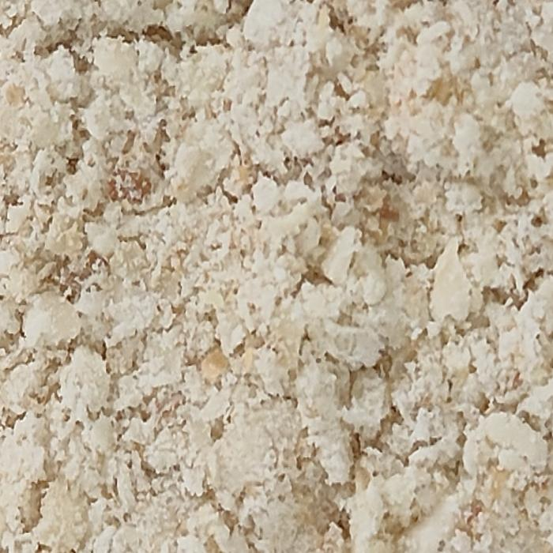
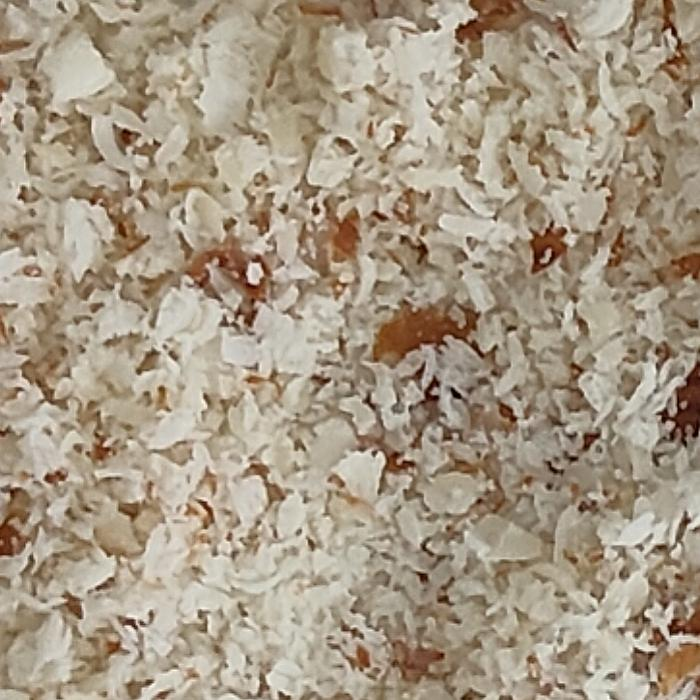
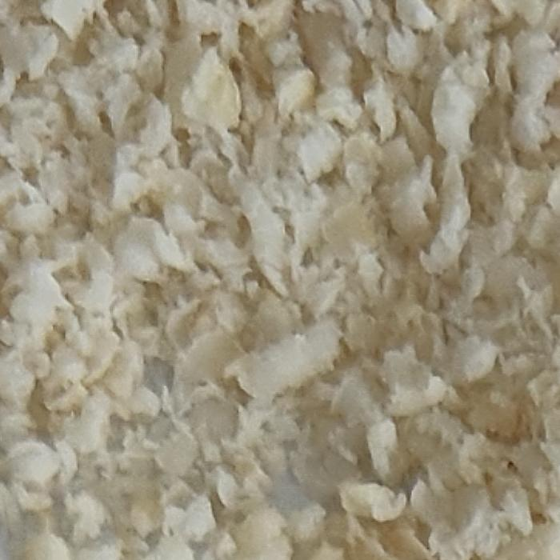
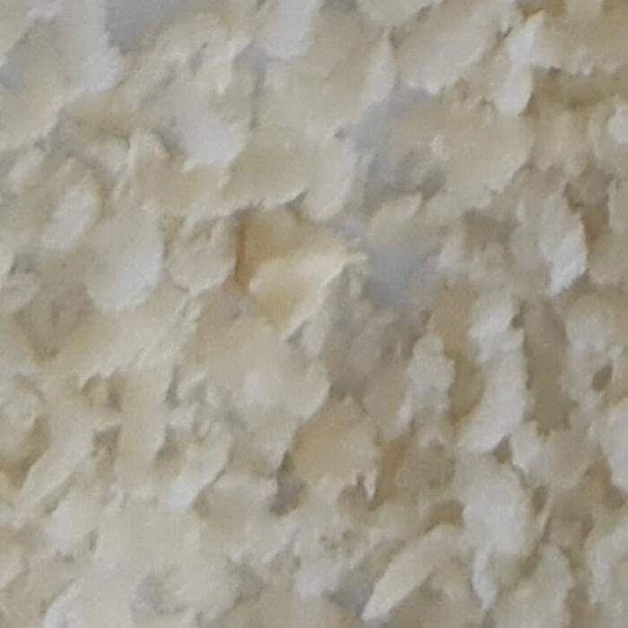
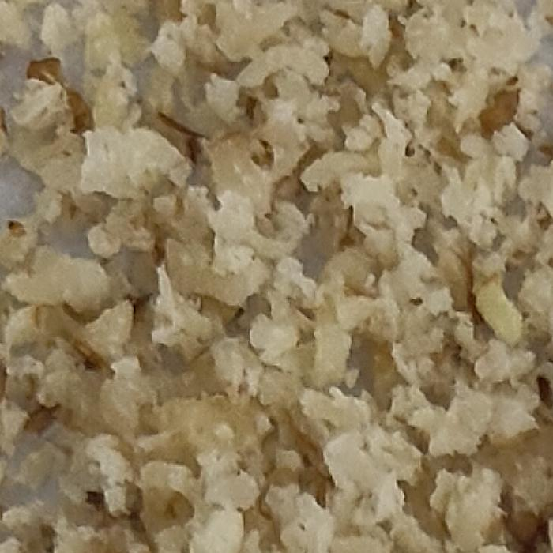
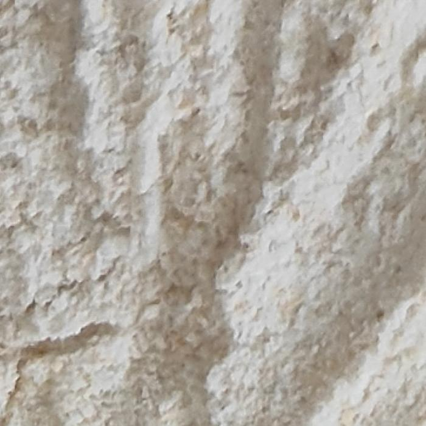
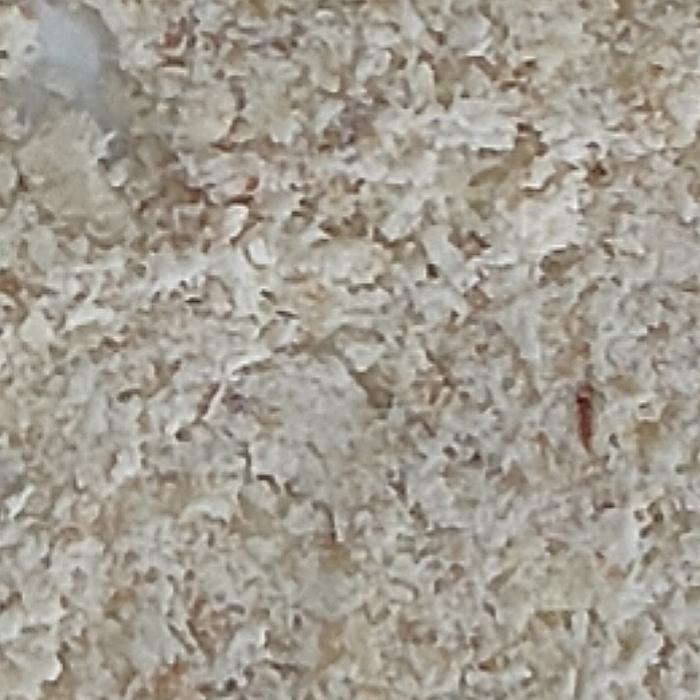
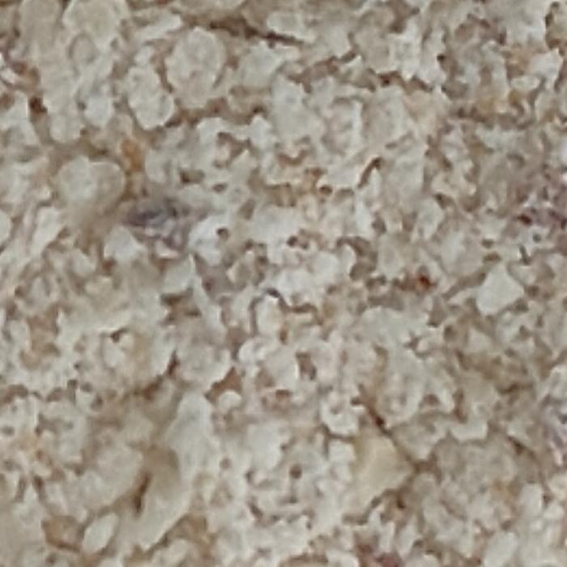
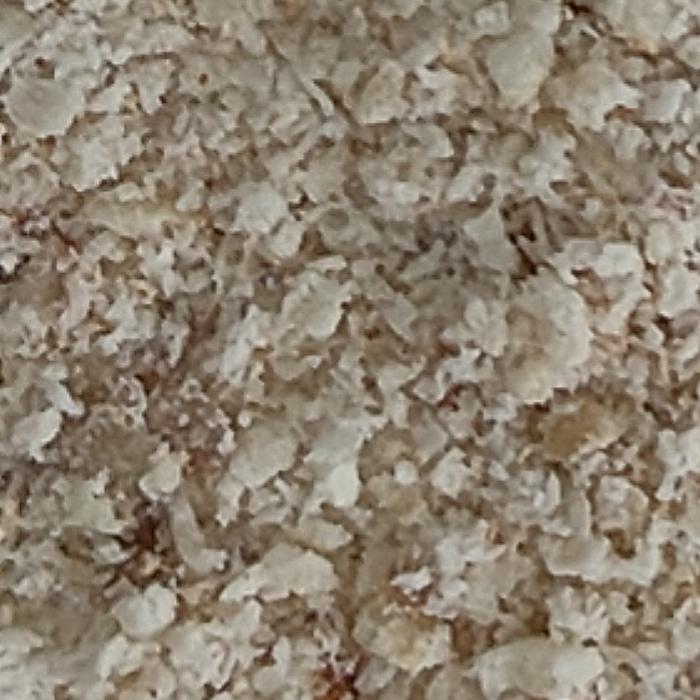
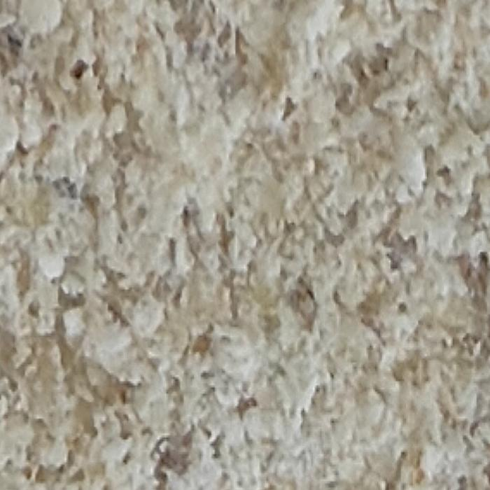
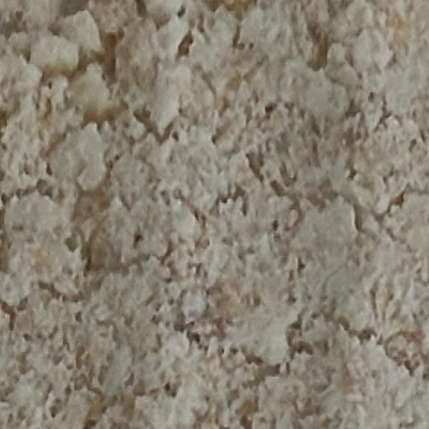
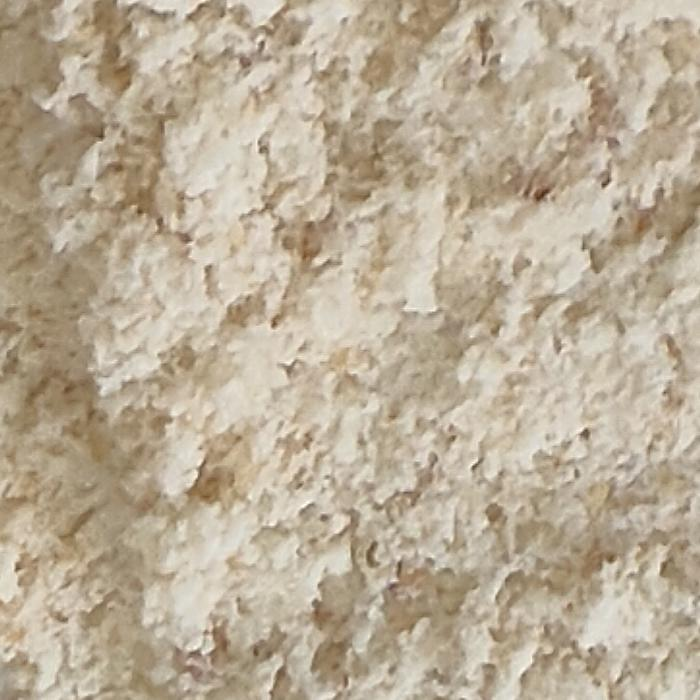
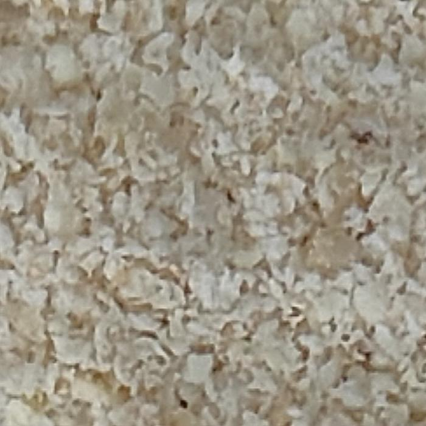
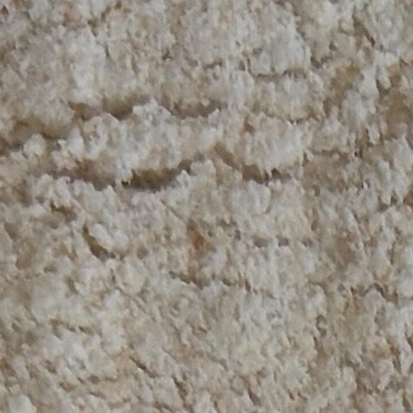
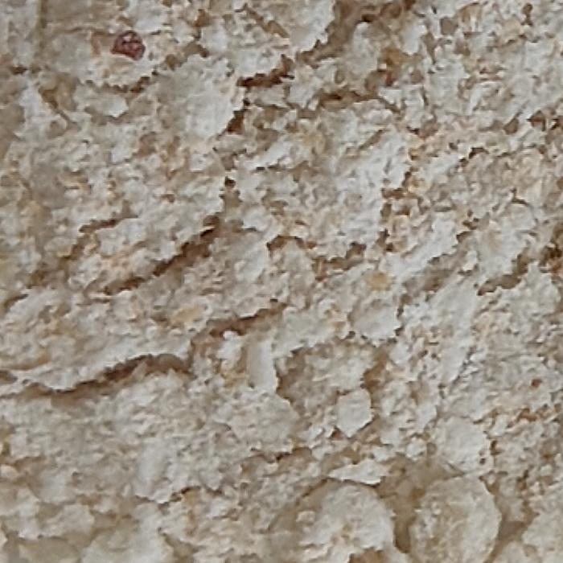
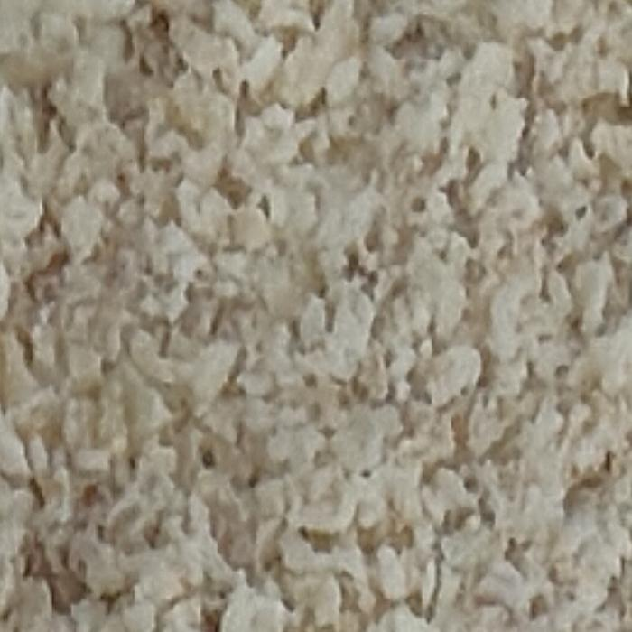
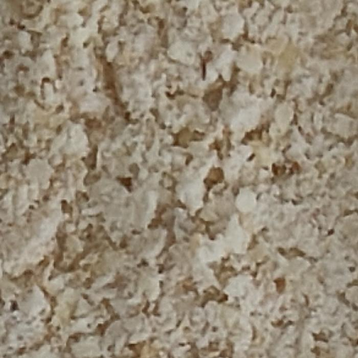
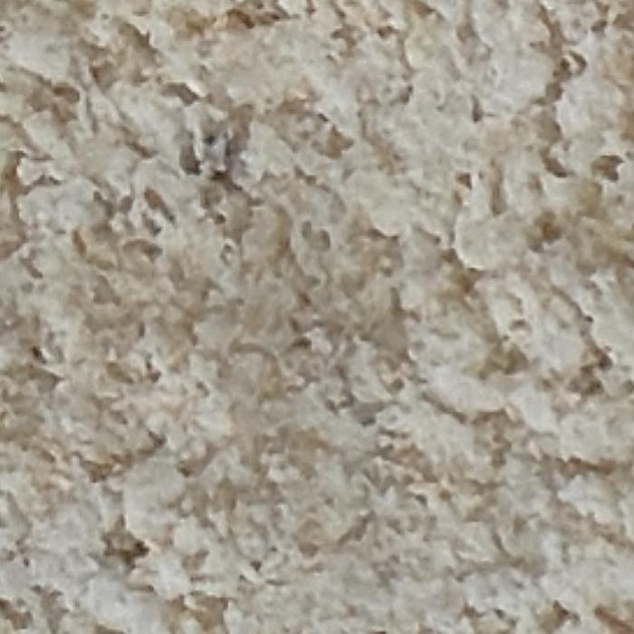
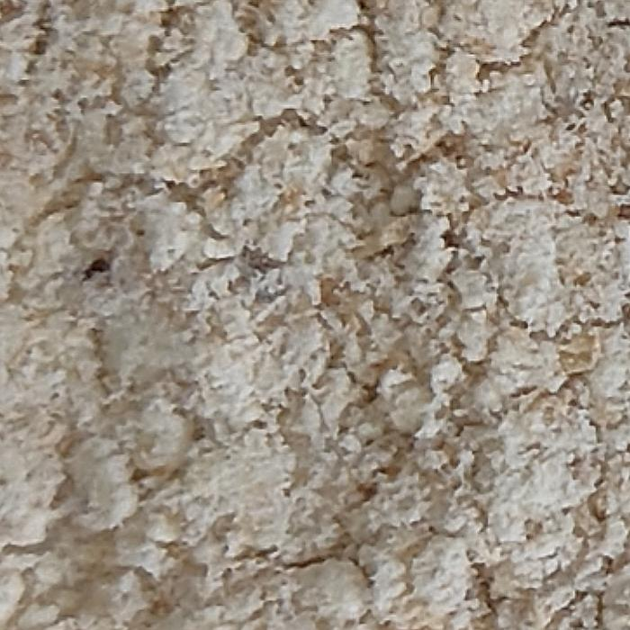


## How to handle the main_project.ipynb file
- **Step 1:** Create a folder named rgb_project in your google drive.
- **Step 2:** Upload the rgb_cropped_images.zip folder to the rgb_project folder in your google drive.
- **Step 3:** Run main_project.ipynb file in google colab.
